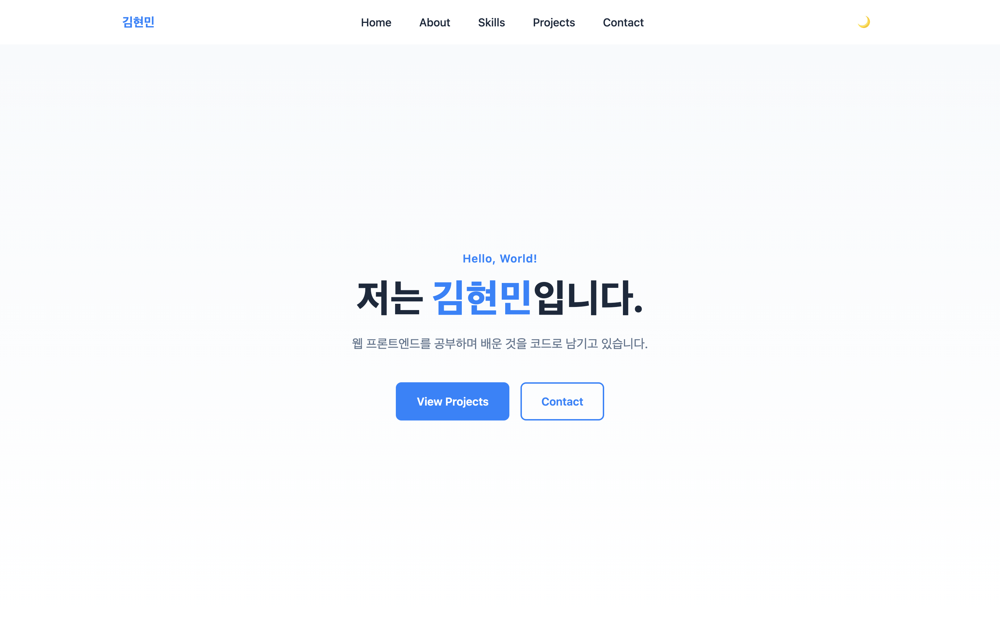
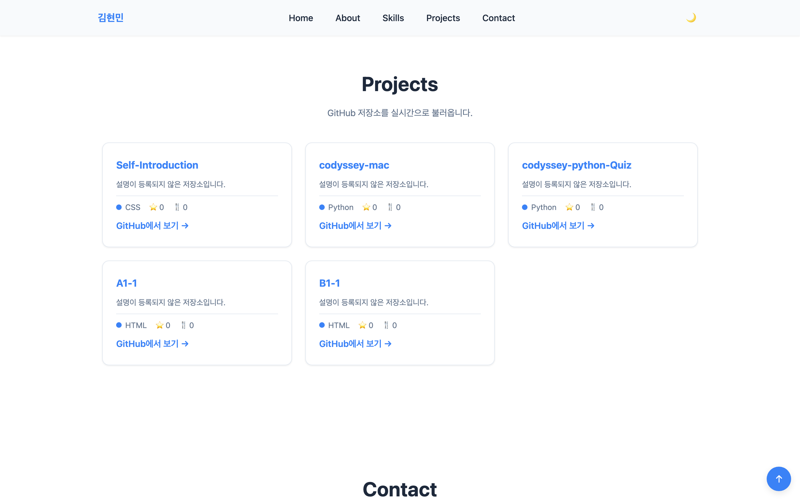
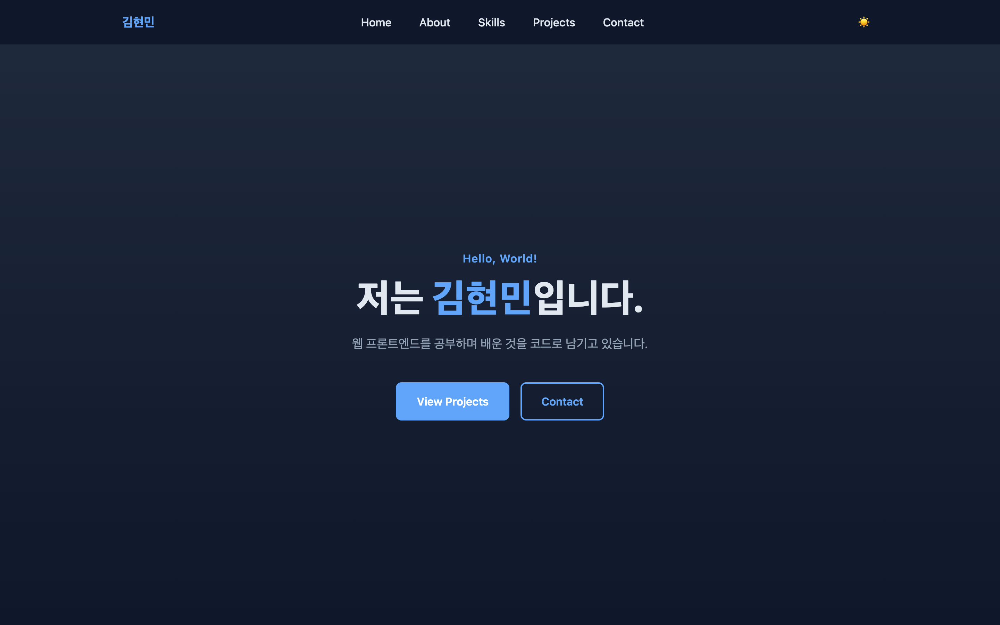
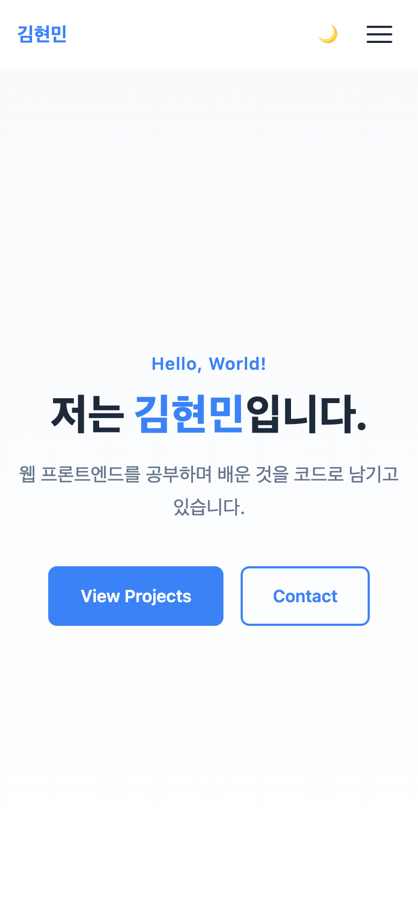

# 김현민 | Portfolio

순수 **HTML · CSS · JavaScript**만으로 만든 반응형 포트폴리오 웹사이트입니다.
프레임워크와 UI 라이브러리를 쓰지 않고, GitHub API를 연동해 저장소 목록을 실시간으로 불러옵니다.

> 코디세이 미션 — 「나를 소개하는 웹페이지 처음부터 만들기」 (AI/SW 기초 · 웹 기초와 프론트엔드)

## 배포 URL

**https://khm0403.github.io/Self-Introduction/**

> 아직 배포 전이라면 이 주소는 동작하지 않습니다. GitHub Pages 배포 후 실제 주소로 확인해주세요.

---

## 스크린샷

### 데스크톱 (1440×900)



### GitHub API 연동 — Projects 섹션

저장소 목록을 `fetch`로 불러와 카드로 렌더링합니다. 언어, 스타 수, 포크 수를 함께 표시합니다.



### 다크 모드

토글 버튼으로 전환하며, 설정은 `localStorage`에 저장되어 새로고침 후에도 유지됩니다.



### 모바일 (390×844)

768px 미만에서 햄버거 메뉴가 나타나고, Projects 카드는 1열로 배치됩니다.




---

## 주요 기능

### 반응형 레이아웃
- 모바일 퍼스트로 작성하고 `min-width` 미디어쿼리로 확장
- 브레이크포인트 **768px**(태블릿) / **1024px**(데스크톱)
- 네비게이션은 **Flexbox**, Projects 카드는 **Grid**(`auto-fit` + `minmax`)

### 인터랙션
| 기능 | 동작 |
|------|------|
| 햄버거 메뉴 | 768px 미만에서 버튼 표시, 클릭 시 서랍 메뉴 열림/닫힘 + 막대가 X자로 변형 |
| 부드러운 스크롤 | 메뉴 클릭 시 해당 섹션으로 이동 (CSS `scroll-behavior: smooth`) |
| 헤더 배경 변경 | 스크롤 **60px** 초과 시 배경색 + 그림자 추가 |
| 스크롤탑 버튼 | 스크롤 **300px** 초과 시 우측 하단에 나타남 |
| 다크 모드 | 토글 클릭 시 테마 전환, **localStorage에 저장되어 새로고침 후에도 유지** |
| 스크롤 애니메이션 | `IntersectionObserver`로 화면에 들어온 요소를 fade-in (**threshold 0.2**) |

### GitHub API 연동
- 엔드포인트 `https://api.github.com/users/khm0403/repos`
- `fetch` + `async/await` + `try/catch`
- `map`으로 저장소 데이터를 카드 HTML로 변환
- **4가지 상태를 모두 UI로 표현**

| 상태 | 화면 |
|------|------|
| 로딩 | 회전 스피너 + "프로젝트를 불러오는 중..." |
| 성공 | 저장소 카드 목록 (이름 / 설명 / 언어 / ⭐ / 🍴 / 링크) |
| 에러 | 에러 메시지 + **[다시 시도]** 버튼 |
| 빈 데이터 | "표시할 프로젝트가 없습니다." |

에러는 상태 코드별로 문구를 다르게 표시합니다.
- `403` → "GitHub API 요청 한도를 초과했습니다. 잠시 후 다시 시도해주세요."
- `404` → "'khm0403' 사용자를 찾을 수 없습니다."
- 그 외 / 네트워크 실패 → "프로젝트를 불러올 수 없습니다."

### 폼 유효성 검사
- 필수값 검증 (이름 / 이메일 / 메시지)
- 이메일 형식 검증 — `/^[^\s@]+@[^\s@]+\.[^\s@]+$/`
- 에러 메시지를 **해당 입력 필드 바로 아래**에 표시하고 테두리를 빨갛게 변경
- 제출 시 `event.preventDefault()`로 새로고침을 막고 성공 메시지 표시
- 한 번 에러가 난 필드는 입력하는 즉시 재검증 (`input` 이벤트)

---

## 사용 기술

| 구분 | 사용 |
|------|------|
| 마크업 | HTML5 시맨틱 태그 (`header` `nav` `main` `section` `article` `footer`) |
| 스타일 | CSS3 — 사용자 정의 속성(변수), Flexbox, Grid, 미디어쿼리, 트랜지션, `@keyframes` |
| 스크립트 | JavaScript ES6+ — `const/let`, 화살표 함수, 템플릿 리터럴, 구조분해 할당, `map`/`forEach`, `async/await` |
| 브라우저 API | `fetch`, `localStorage`, `IntersectionObserver` |
| 외부 데이터 | GitHub REST API v3 |
| 접근성 | `aria-label`, `aria-expanded`, `aria-controls`, `aria-live`, `role="alert"`, `label` ↔ `input` 연결 |

**외부 라이브러리를 일절 사용하지 않았습니다.** (React, Vue, jQuery, Bootstrap, Tailwind 모두 미사용)

---

## 프로젝트 구조

```
.
├── index.html              # 페이지 전체 (212줄)
├── css/
│   └── style.css           # 스타일시트 (820줄)
├── js/
│   └── main.js             # 동작 (300줄)
├── images/
│   ├── profile-placeholder.svg
│   └── screenshots/       # 스크린샷 4장
└── README.md
```

### CSS 구성 순서
```
 1. CSS 변수 (:root)          10. Projects — Grid / 카드 / 상태 UI
 2. 초기화 (reset)            11. Contact 폼
 3. 레이아웃 유틸             12. Footer
 4. 섹션 제목                 13. 스크롤탑 버튼
 5. 버튼                      14. 스크롤 애니메이션
 6. 헤더 / 네비게이션         15. 다크 모드 (변수 재정의)
 7. Hero                      16. 반응형 768px
 8. About                     17. 반응형 1024px
 9. Skills                    18. 모션 최소화 설정 존중
```

### JS 구성 순서
```
 0. 설정값        1. 요소 참조      2. 햄버거 메뉴
 3. 스크롤 이벤트  4. 다크 모드      5. GitHub API + 상태 렌더링
 6. 폼 유효성 검사 7. IntersectionObserver
```

---

## 설정값 (임계값 명시)

과제 요구사항에 따라 코드에서 사용한 기준값을 명시합니다.
전부 `js/main.js` 상단의 상수로 분리되어 있어 한 곳에서 수정할 수 있습니다.

```js
const GITHUB_USERNAME = 'khm0403';
const HEADER_SCROLL_THRESHOLD = 60;   // 헤더 배경이 바뀌는 스크롤 위치(px)
const SCROLL_TOP_THRESHOLD = 300;     // 스크롤탑 버튼이 나타나는 위치(px)
const OBSERVER_THRESHOLD = 0.2;       // 스크롤 애니메이션 임계값
const THEME_STORAGE_KEY = 'portfolio-theme';
```

| 항목 | 값 | 위치 |
|------|-----|------|
| 헤더 배경 변경 기준 | `60px` | `js/main.js` |
| 스크롤탑 버튼 표시 기준 | `300px` | `js/main.js` |
| IntersectionObserver threshold | `0.2` | `js/main.js` |
| localStorage 키 | `portfolio-theme` | `js/main.js` |
| 태블릿 브레이크포인트 | `768px` | `css/style.css` |
| 데스크톱 브레이크포인트 | `1024px` | `css/style.css` |
| 콘텐츠 최대 폭 | `1120px` | `css/style.css` (`--container-max`) |
| 헤더 높이 | `64px` | `css/style.css` (`--header-height`) |

---

## 상태 → 렌더링 흐름

이 과제의 핵심 요구사항인 **"사용자 이벤트 → 상태 변경 → 화면 업데이트"** 흐름 4가지입니다.

| # | 이벤트 | 상태 | 렌더링 |
|---|--------|------|--------|
| 1 | 토글 버튼 `click` | `data-theme` = `light` / `dark` + localStorage | CSS 변수가 통째로 교체되어 전체 색상 전환 |
| 2 | 페이지 로드 / 재시도 `click` | 로딩 → 성공 · 에러 · 빈 상태 | Projects 섹션 내용 교체 |
| 3 | 폼 `submit` / `input` | 필드별 에러 메시지 문자열 | 에러 문구 표시·숨김 + 테두리 색 변경 |
| 4 | 햄버거 `click` | `.active` 클래스 + `aria-expanded` | 서랍 메뉴 열림/닫힘 + 버튼 X자 변형 |

각 흐름은 **상태를 바꾸는 함수**와 **상태를 보고 그리는 함수**가 분리되어 있습니다.
예를 들어 다크 모드는 `applyTheme(theme)` 하나만 화면을 그리고, 클릭 핸들러는 다음 상태를 계산해 넘기기만 합니다.

---

## 로컬에서 실행하기

`file://`로 열면 브라우저 보안 정책 때문에 GitHub API 호출이 차단됩니다. **반드시 로컬 서버로 실행**하세요.

**VS Code Live Server**
```
index.html 우클릭 → Open with Live Server
```

**또는 Python 내장 서버**
```bash
python3 -m http.server 5500
```
실행 후 브라우저에서 `http://localhost:5500` 접속.

---

## GitHub API 주의사항

인증 없이 호출하면 **IP당 시간당 60회** 제한이 있습니다.
짧은 시간에 반복해서 새로고침하면 `403`이 반환되고, 이때 에러 상태 UI와 [다시 시도] 버튼이 표시됩니다.

---

## 학습 목표

이 프로젝트를 통해 아래를 직접 구현하며 익혔습니다.

- HTML 시맨틱 태그의 선택 기준과 문서 구조 설계
- Flexbox와 Grid의 차이, 그리고 상황별 선택
- `querySelector`로 DOM을 선택하고 `addEventListener`로 이벤트를 연결하는 흐름
- 화살표 함수 · 구조분해 할당 · 배열 메서드(`map` / `filter` / `forEach`)의 용도
- `fetch` + `async/await`로 비동기 데이터를 가져오고 로딩 · 성공 · 실패 상태를 UI로 표현
- **이벤트 → 상태 변경 → DOM 업데이트**로 하나의 기능을 완성하는 패턴
